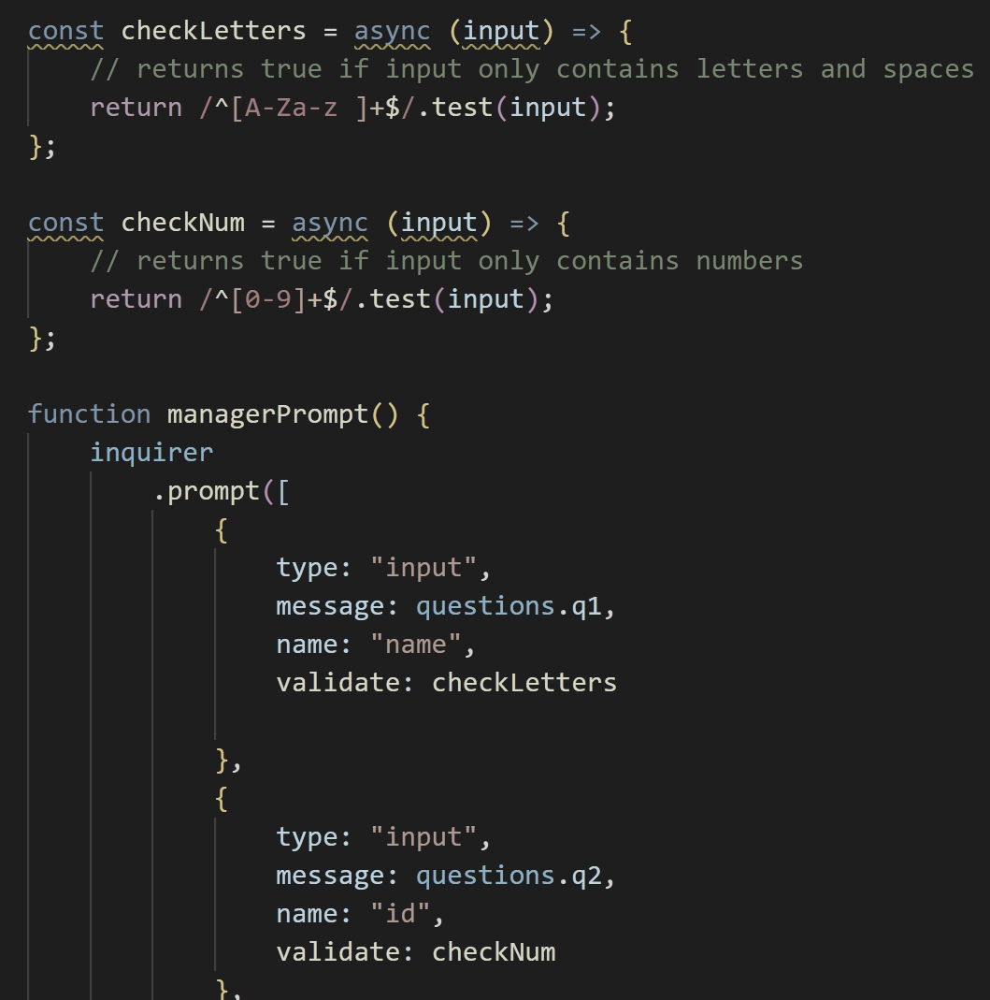
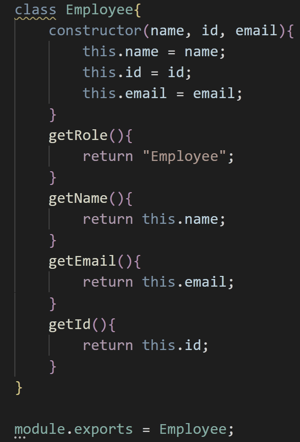

# Team Template Generator

## Description
This application is an HTML generator that takes user input and creates a styled HTML file. The main pieces of this application are multiple JS files containing classes. The application grabs user input using Inquirer, and error checks to make sure the user inputs the correct character type for a given question.  Each time a set of four questions is answered, those responses are saved to the class matching their job type(eg. Manager, Engineer, Intern) and they are asked if they would like to add additional team members. That class is then pushed into an array of employees, and this cycle continues until the user selects "done". At this point, the create function is called which calls the render function that assigns all saved employees to an appropriate place in a pre-made HTML template. There is then an if statement that checks if the output directory exists, and creates it if it does not. The modified template is then written to the team.html file in the output folder. 
  
## Table of Contents
* [Description](#description)
* [Installation](#installation)
* [Usage](#usage)
* [Code Snippets](#code_snippets)
* [Testing](#testing)
* [Built With](#built_with)
* [Author](#author)
* [License](#license)

## Installation
To install all dependencies, run Npm install in your terminal while opened to the file path you downloaded to. 

## Usage
To run this application, open your terminal to the folder it is located in and type "npm install". When those files are finished downloading type "node index.js" to run the application. Follow the series of prompts to the best of your ability, and the application will generate an html file containing all inputted information. When you would like to stop adding team members, select "done". For the name and school prompts, you may only enter letters of the alphabet as well as spaces. For the ID and office number prompts, you may only enter numbers. 

[Video Walkthrough](https://drive.google.com/file/d/1g34jK60nmXiR4M5VT_EARLdB1SVrTA7u/view)

## Code Snippets
This code snippet contains the JavaScript used to test user input for correct characters. I used RegEx to compare the input to a specific set of characters. For the letter check, I used the alphabet in both capital and lowercase including spaces, and for the number check just numbers. 

This code snippet contains the constructor for the Employee class. This is the parent class for all other team classes. For manager, intern, and engineer I pulled the name, id, and email from this class and added on additional properties and methods based on their unique attributes. 

## Testing
To run tests on this application, open your terminal to the directory in which this application is installed, and type "npm run test". 

## Built_with
* JavaScript
* HTML
* [Bootstrap](https://getbootstrap.com/)
* [NodeJS](https://nodejs.org/en/)
* [Inquirer](https://www.npmjs.com/package/inquirer)
* [Github](https://github.com/)
  
## Author
Jonathan SanPedro - Bachelors of Information Technology at Rutgers New Brunswick - Student at Berkeley Coding Bootcamp
  

## License

MIT License

Copyright &copy; [2020] [Jonathan J. SanPedro]

Permission is hereby granted, free of charge, to any person obtaining a copy
of this software and associated documentation files (the "Software"), to deal
in the Software without restriction, including without limitation the rights
to use, copy, modify, merge, publish, distribute, sublicense, and/or sell
copies of the Software, and to permit persons to whom the Software is
furnished to do so, subject to the following conditions:

The above copyright notice and this permission notice shall be included in all
copies or substantial portions of the Software.

THE SOFTWARE IS PROVIDED "AS IS", WITHOUT WARRANTY OF ANY KIND, EXPRESS OR
IMPLIED, INCLUDING BUT NOT LIMITED TO THE WARRANTIES OF MERCHANTABILITY,
FITNESS FOR A PARTICULAR PURPOSE AND NONINFRINGEMENT. IN NO EVENT SHALL THE
AUTHORS OR COPYRIGHT HOLDERS BE LIABLE FOR ANY CLAIM, DAMAGES OR OTHER
LIABILITY, WHETHER IN AN ACTION OF CONTRACT, TORT OR OTHERWISE, ARISING FROM,
OUT OF OR IN CONNECTION WITH THE SOFTWARE OR THE USE OR OTHER DEALINGS IN THE
SOFTWARE.